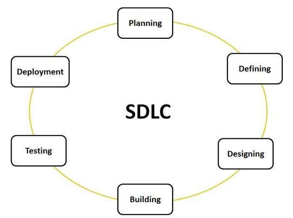

# SDLC Process and Methods
SDLC, Software Development Life Cycle is a process used by software industry to design, develop and test high quality softwares. The SDLC aims to produce a high quality software that meets or exceeds customer expectations, reaches completion within times and cost estimates.

- SDLC is the acronym of Software Development Life Cycle.
- The software development life cycle (SDLC) is a framework defining tasks performed at each step in the software development process.

***What is SDLC?***
SDLC is a process followed for a software project, within a software organization. It consists of a detailed plan describing how to develop, maintain, replace and alter or enhance specific software. The life cycle defines a methodology for improving the quality of software and the overall development process.

The following figure is a graphical representation of the various stages of a typical SDLC.

A typical Software Development life cycle consists of the following stages:

## Stage 1: Planning and Requirement Analysis
Requirement analysis is the most important and fundamental stage in SDLC. It is performed by the senior members of the team with inputs from the customer, the sales department, market surveys and domain experts in the industry. This information is then used to plan the basic project approach and to conduct product feasibility study in the economical, operational, and technical areas.

Planning for the quality assurance requirements and identification of the risks associated with the project is also done in the planning stage. The outcome of the technical feasibility study is to define the various technical approaches that can be followed to implement the project successfully with minimum risks.

## Stage 2: Defining Requirements
Once the requirement analysis is done the next step is to clearly define and document the product requirements and get them approved from the customer or the market analysts. This is done through .SRS. . Software Requirement Specification document which consists of all the product requirements to be designed and developed during the project life cycle.

## Stage 3: Designing the product architecture
SRS is the reference for product architects to come out with the best architecture for the product to be developed. Based on the requirements specified in SRS, usually more than one design approach for the product architecture is proposed and documented in a DDS - Design Document Specification.

This DDS is reviewed by all the important stakeholders and based on various parameters as risk assessment, product robustness, design modularity , budget and time constraints , the best design approach is selected for the product.

A design approach clearly defines all the architectural modules of the product along with its communication and data flow representation with the external and third party modules (if any). The internal design of all the modules of the proposed architecture should be clearly defined with the minutest of the details in DDS.

## Stage 4: Building or Developing the Product
In this stage of SDLC the actual development starts and the product is built. The programming code is generated as per DDS during this stage. If the design is performed in a detailed and organized manner, code generation can be accomplished without much hassle.

Developers have to follow the coding guidelines defined by their organization and programming tools like compilers, interpreters, debuggers etc are used to generate the code. Different high level programming languages such as C, C++, Pascal, Java, and PHP are used for coding. The programming language is chosen with respect to the type of software being developed.

## Stage 5: Testing the Product
This stage is usually a subset of all the stages as in the modern SDLC models, the testing activities are mostly involved in all the stages of SDLC. However this stage refers to the testing only stage of the product where products defects are reported, tracked, fixed and retested, until the product reaches the quality standards defined in the SRS.

## Stage 6: Deployment in the Market and Maintenance
Once the product is tested and ready to be deployed it is released formally in the appropriate market. Sometime product deployment happens in stages as per the organizations, business strategy. The product may first be released in a limited segment and tested in the real business environment.

Then based on the feedback, the product may be released as it is or with suggested enhancements in the targeting market segment. After the product is released in the market, its maintenance is done for the existing customer base.

## SDLC or SDP (Software Development Process) Models
- [1. Waterfall Model]()
- [2. Iterative Model]()
- [3. Spiral Model]()
- [4. V-Model]()
- [5. BigBang Model]()
- [6. Agile Model]()
- [7. RAD Model]()
- [8. Software Prototype](08-Software-Prototype.md)
01-Waterfall-Model.md
02-Iterative-Model.md
03-Spiral-Model.md
04-V-Model.md
05-BigBang-Model.md
06-Agile-Model.md
07-RAD-Model.md

